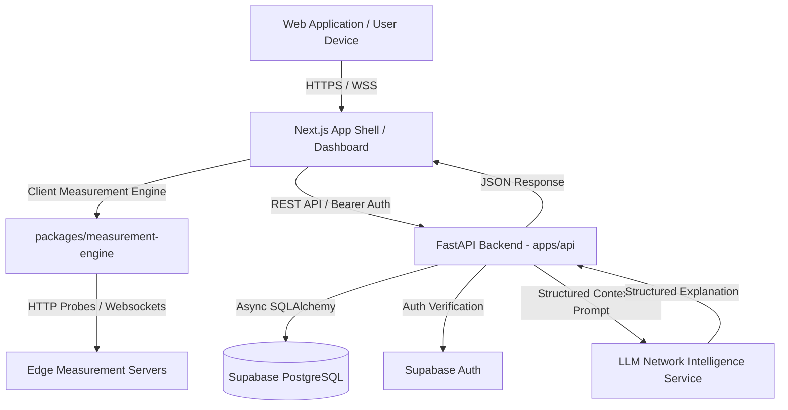

# Architecture Overview — IPMCAS Platform

## 1. System Goals & Design Philosophy

The **IPMCAS** (Internet Performance Measurement, Comparison and AI Support) platform is engineered to deliver accurate, reproducible, and verifiable Internet quality measurements across diverse client environments (Wi-Fi, Ethernet, 4G, 5G).

The architectural design prioritizes:
- **Clean Separation of Concerns**: Strict boundary between frontend client UI, backend control plane, measurement engine execution, persistent database, and AI service.
- **Scientific Integrity**: Grounded in empirical research findings from DRDO experiments E2, E3, and E4.
- **Empirical Accuracy**: Explicit measurement status taxonomy (distinguishing server rate-limiting HTTP 429 from physical speed loss).
- **Security & Privacy**: Zero client access to database service-role keys or AI secrets; strict Row Level Security (RLS) on PostgreSQL.

---

## 2. High-Level System Architecture Diagram



---

## 3. Data Flow Architecture

```text
USER DEVICE
    │
    ▼
1. Initialize Session ──────> [FastAPI Backend] ──> Select Edge Test Server & Create Session ID
    │
    ▼
2. Run Latency Probe ───────> Ping Endpoints (Min / Avg / Max / Jitter)
    │
    ▼
3. Run Download Stream ─────> Parallel Chunk Downloads (N=1..16 Concurrency)
    │
    ▼
4. Run Upload Stream ───────> POST Payload Telemetry
    │
    ▼
5. Validation & Metric Calc ─> Compute Mean, Median, StdDev, 95% CI, Status Validation
    │
    ▼
6. Store Result ─────────────> [FastAPI Backend] ──> Persist Session to Supabase PostgreSQL
    │
    ▼
7. AI Network Analysis ──────> [Backend LLM Agent] ◄── Inject Database Statistics (No Hallucination)
    │
    ▼
8. Interactive Dashboard ────> Render Recharts Time-Series & Network Comparison UI
```

---

## 4. Architectural Layer Boundaries

| Layer | Technology | Responsibilities | Key Restrictions |
|---|---|---|---|
| **Frontend** | Next.js 14+, React, Tailwind CSS | UI rendering, client-side speed test orchestration, local visual telemetry | No direct database connection; No API keys stored |
| **Backend API** | Python FastAPI, Pydantic v2 | Session management, input validation, statistical computation, AI orchestration | Thin route handlers; logic in services |
| **Measurement Engine** | TS & Python modules | Stream chunking, concurrency control, latency sampling, HTTP 429 classification | Reusable across web and CLI runners |
| **Database** | Supabase PostgreSQL | Normalized measurement storage, historical indexes, Row Level Security | RLS enforced for user data protection |
| **AI Assistant** | Backend LLM Adapter | Context-aware network diagnostic reasoning | Cannot invent metrics or run raw SQL |
