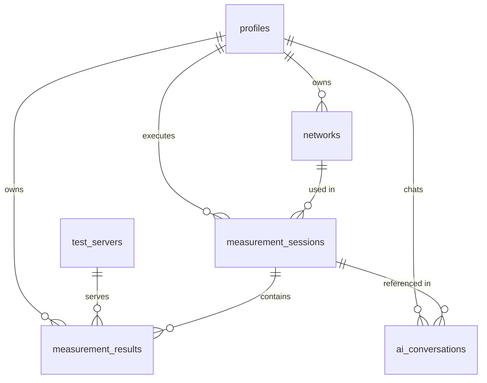

# Database Schema — Supabase PostgreSQL

## 1. Overview & Entity Relationship Model

The database uses a normalized PostgreSQL schema managed via **Supabase**. It provides historical storage, statistical query performance, and strict multi-tenant security via **Row Level Security (RLS)**.



---

## 2. Table Specifications

### 2.1 `profiles`
Linked to Supabase `auth.users(id)`. Automatically populated via PostgreSQL trigger `public.handle_new_user()`.
- `id` (UUID, Primary Key, Foreign Key -> `auth.users.id` ON DELETE CASCADE)
- `email` (TEXT, Not Null)
- `display_name` (TEXT)
- `created_at` (TIMESTAMPTZ, Default NOW())
- `updated_at` (TIMESTAMPTZ, Default NOW())

### 2.2 `networks`
Tracks distinct user network environments.
- `id` (UUID, Primary Key, Default gen_random_uuid())
- `user_id` (UUID, Foreign Key -> `profiles.id` ON DELETE CASCADE, Index)
- `network_type` (VARCHAR(32), Enum: `WIFI`, `ETHERNET`, `CELLULAR_4G`, `CELLULAR_5G`, `UNKNOWN`)
- `network_name` (TEXT)
- `isp` (TEXT)
- `asn` (INTEGER)
- `country` (VARCHAR(2))
- `region` (TEXT)
- `hashed_ip` (TEXT)
- `created_at` (TIMESTAMPTZ, Default NOW())

### 2.3 `test_servers`
Directory of valid measurement edge nodes.
- `id` (UUID, Primary Key, Default gen_random_uuid())
- `name` (TEXT, Not Null)
- `base_url` (TEXT, Not Null)
- `region` (TEXT, Not Null)
- `country` (VARCHAR(2), Not Null)
- `latitude` (DOUBLE PRECISION, Not Null)
- `longitude` (DOUBLE PRECISION, Not Null)
- `capabilities` (JSONB, Default `{"download": true, "upload": true, "latency": true}`)
- `priority` (INTEGER, Default 10)
- `is_active` (BOOLEAN, Default true)
- `created_at` (TIMESTAMPTZ, Default NOW())
- `updated_at` (TIMESTAMPTZ, Default NOW())

### 2.4 `measurement_sessions`
Groups individual multi-phase speed tests.
- `id` (UUID, Primary Key, Default gen_random_uuid())
- `user_id` (UUID, Foreign Key -> `profiles.id` ON DELETE CASCADE, Index)
- `network_id` (UUID, Foreign Key -> `networks.id` ON DELETE SET NULL, Index)
- `started_at` (TIMESTAMPTZ, Default NOW())
- `completed_at` (TIMESTAMPTZ, Nullable)
- `status` (VARCHAR(32), Default 'INITIALIZING')
- `client_metadata` (JSONB, Default `{}`)
- `created_at` (TIMESTAMPTZ, Default NOW())

### 2.5 `measurement_results`
Detailed numerical results for completed speed test phases.
- `id` (UUID, Primary Key, Default gen_random_uuid())
- `session_id` (UUID, Foreign Key -> `measurement_sessions.id` ON DELETE CASCADE, Index)
- `user_id` (UUID, Foreign Key -> `profiles.id` ON DELETE CASCADE, Index)
- `server_id` (UUID, Foreign Key -> `test_servers.id`)
- `test_type` (VARCHAR(32), Default 'FULL')
- `concurrency` (INTEGER, Default 4)
- `configured_duration_s` (DOUBLE PRECISION, Default 10.0)
- `actual_duration_s` (DOUBLE PRECISION, Not Null)
- `bytes_transferred` (BIGINT, Default 0)
- `throughput_mbps` (DOUBLE PRECISION, Default 0.0)
- `latency_min_ms` (DOUBLE PRECISION, Default 0.0)
- `latency_avg_ms` (DOUBLE PRECISION, Default 0.0)
- `latency_median_ms` (DOUBLE PRECISION, Default 0.0)
- `latency_max_ms` (DOUBLE PRECISION, Default 0.0)
- `jitter_ms` (DOUBLE PRECISION, Default 0.0)
- `packet_loss_percent` (DOUBLE PRECISION, Nullable)
- `total_requests` (INTEGER, Default 0)
- `successful_requests` (INTEGER, Default 0)
- `rate_limited_requests` (INTEGER, Default 0) -- HTTP 429 count
- `other_http_errors` (INTEGER, Default 0)
- `request_exceptions` (INTEGER, Default 0)
- `http_status` (INTEGER, Default 200)
- `status` (VARCHAR(32), Not Null)
- `error` (TEXT, Nullable)
- `timestamp` (TIMESTAMPTZ, Default NOW())
- `created_at` (TIMESTAMPTZ, Default NOW())

### 2.6 `ai_conversations`
Logs user questions and backend AI assistant context.
- `id` (UUID, Primary Key, Default gen_random_uuid())
- `user_id` (UUID, Foreign Key -> `profiles.id` ON DELETE CASCADE, Index)
- `session_id` (UUID, Foreign Key -> `measurement_sessions.id` ON DELETE SET NULL)
- `role` (VARCHAR(32), Default 'user')
- `message` (TEXT, Not Null)
- `context` (JSONB, Default `{}`)
- `created_at` (TIMESTAMPTZ, Default NOW())

---

## 3. Row Level Security (RLS) Policies

```sql
-- Enable RLS
ALTER TABLE profiles ENABLE ROW LEVEL SECURITY;
ALTER TABLE networks ENABLE ROW LEVEL SECURITY;
ALTER TABLE measurement_sessions ENABLE ROW LEVEL SECURITY;
ALTER TABLE measurement_results ENABLE ROW LEVEL SECURITY;
ALTER TABLE ai_conversations ENABLE ROW LEVEL SECURITY;
ALTER TABLE test_servers ENABLE ROW LEVEL SECURITY;

-- User Policies (auth.uid() = user_id)
CREATE POLICY "Profiles self access" ON profiles FOR ALL USING (auth.uid() = id);
CREATE POLICY "Networks self access" ON networks FOR ALL USING (auth.uid() = user_id);
CREATE POLICY "Sessions self access" ON measurement_sessions FOR ALL USING (auth.uid() = user_id);
CREATE POLICY "Results self access" ON measurement_results FOR ALL USING (auth.uid() = user_id);
CREATE POLICY "AI Conversations self access" ON ai_conversations FOR ALL USING (auth.uid() = user_id);

-- Test Servers Policies
CREATE POLICY "Test Servers Public Read" ON test_servers FOR SELECT USING (true);
CREATE POLICY "Test Servers Service Role Write" ON test_servers FOR ALL USING (auth.role() = 'service_role');
```
